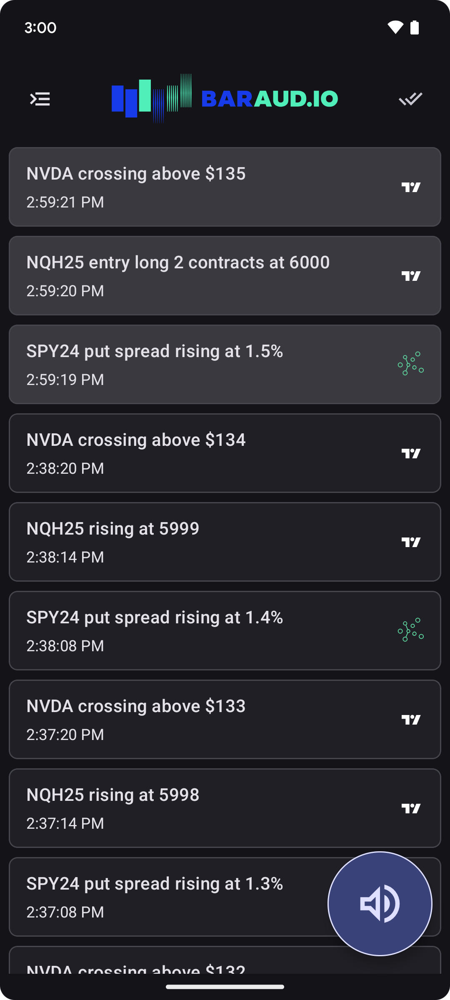
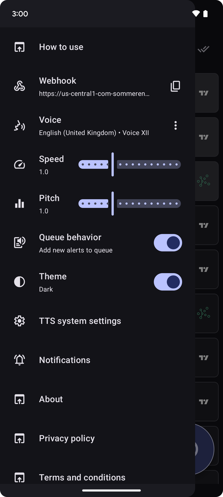
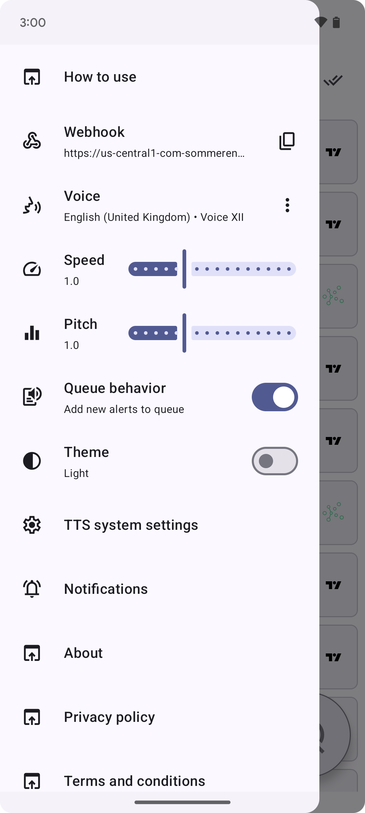

# BarAudio

### Overview

[BarAudio](https://baraud.io/) is an Android app available on the [Play Store](https://play.google.com/store/apps/details?id=com.sommerengineering.baraudio) as a monthly subscription. It's written primarily in Kotlin, using Compose declarative UI, Firebase products, and a serverless backend with Google Cloud. The app provides audible market notifications to financial day traders. 

Price, volume, and top-level metrics for securities are emitted from the exchanges in realtime. To be an effective trader, digital charts must be monitored constantly throughout the day. This can be visually straining and tedious. Audio alerts from a mobile device provide an alternative information delivery, allowing investors to step away from their screens with confidence.

### Intended User

The intended user of this app is a securities day trader. This person buys and sells stocks, forex, commodities, or other financial instruments multiple times in a single day. This can be a casual trader with sporadic participation, or a professional investor whose income derives from the market cycle.

### Primary Features

- All exchange data available in realtime
- Audio notifications customized by language, voice, speed, and pitch
- Modern UI designed for Android 15
- Sign-in with Google or GitHub
- Secure webhook urls on Google Cloud
- Unlimited webhook requests
- Unlimited message storage

### Monetization

A free trial is offered for one week, then converts to a rolling subscription of $5.99 per month. BarAudio does not contain advertisements.

### Technical Notes

- Compose using Material Design 3
- MVVM architecture
- Koin dependency injection
- Webhook endpoint deployed on Google Cloud Functions
- Firebase Cloud Messaging for notifications
- Firebase Realtime Database for local and cloud storage
- Google and GitHub federated authentication providers
- Text-to-speech engines for audible alerts
- Compatible with API 35, Android 15

### User Experience
  

  

  

  
